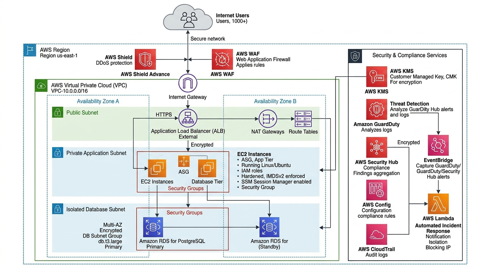

# Secure Multi-Tier Architecture with AWS KMS, GuardDuty, Security Hub & Config

[](https://aws.amazon.com/security/)
[](https://aws.amazon.com/security-hub/)
[](https://aws.amazon.com/guardduty/)
[](https://aws.amazon.com/eventbridge/)
[](LICENSE)

An enterprise defense-in-depth cloud security architecture protecting a three-tier web application stack. Enforces end-to-end cryptographic control using **AWS KMS Customer Managed Keys (CMKs)**, automated database credential rotation via **AWS Secrets Manager**, continuous intelligent threat detection with **Amazon GuardDuty**, aggregated posture benchmarking against **CIS AWS Foundations v1.4.0** in **AWS Security Hub**, automated non-compliance remediation with **AWS Config**, and zero-touch incident isolation via **Amazon EventBridge and AWS Lambda**.

---

## Table of Contents

- [Solution Overview](#solution-overview)
- [Architecture Diagram](#architecture-diagram)
- [AWS Services Used & Why](#aws-services-used--why)
- [Defense-in-Depth Security Model](#defense-in-depth-security-model)
- [Design Decisions & Well-Architected Security Pillar Alignment](#design-decisions--well-architected-security-pillar-alignment)
- [Cost Estimation & Optimization](#cost-estimation--optimization)

---

## Solution Overview

Single-layer security controls (such as relying exclusively on perimeter firewalls) fail when credentials are leaked, software vulnerabilities are exploited, or internal misconfigurations occur.

This architecture enforces **Defense-in-Depth across 5 distinct protective layers**:
- **Data Protection**: Customer Managed Keys (CMKs) in AWS KMS encrypt EBS root volumes, RDS database storage, and S3 objects with annual automated rotation and cryptographically segregated key policies.
- **Identity & Access Governance**: Strict IAM permission boundaries prevent privilege escalation; Service Control Policies (SCPs) disable root account API usage and block unapproved foreign AWS regions.
- **Continuous Threat Detection**: Amazon GuardDuty analyzes CloudTrail management and data events, VPC Flow Logs, and DNS queries with machine learning to identify reconnaissance, credential exposure, and crypto-mining activity.
- **Automated Incident Response**: High-severity security events trigger an EventBridge rule that immediately executes a Lambda function, isolating the compromised EC2 instance into a quarantine security group and capturing memory forensics.

---

## Architecture Diagram




---

## AWS Services Used & Why

| Service | Role in Architecture | Why We Chose This Service |
|---|---|---|
| **AWS KMS (Customer Managed Keys - CMKs)** | Cryptographic Control | Customer Managed Keys enforce cryptographically segregated access policies, separate duties between administrators and users, and support automated annual key rotation for EBS, RDS, and S3 data at rest. |
| **Amazon GuardDuty** | Intelligent Threat Detection | Employs machine learning, anomaly detection, and integrated threat intelligence to analyze CloudTrail event logs, VPC Flow Logs, and DNS queries. Detects compromised IAM credentials, unusual API activity, and potential malware communication without agent overhead. |
| **AWS Security Hub** | Posture Management & Compliance | Aggregates security findings from GuardDuty, IAM Access Analyzer, and AWS Config. Automatically scores environment security against industry standards (CIS AWS Foundations Benchmark v1.4.0 and PCI DSS). |
| **AWS Config** | Continuous Governance & Auto-Remediation | Continuously evaluates the configurations of AWS resources against predefined security baselines (e.g. S3 bucket public read block, EBS volume encryption). Initiates remediation workflows automatically upon detecting drift. |
| **AWS Secrets Manager** | Automated Credential Rotation | Securely stores and encrypts database credentials, automatically rotating RDS master passwords every 30 days via Lambda without downtime or hardcoded secrets. |
| **AWS WAF & AWS Shield Standard** | Edge Perimeter & DDoS Mitigation | Blocks common application-layer web exploits (SQLi, XSS, SSRF) and provides automatic defense against Layer 3 and Layer 4 volumetric DDoS attacks. |
| **Amazon EventBridge & AWS Lambda** | Zero-Touch Incident Quarantine | Instantly reacts to high-severity findings (severity >= 7.0) by triggering a serverless Lambda function to detach vulnerable security groups and apply an isolation quarantine security group in under 5 seconds. |
| **AWS Systems Manager (Session Manager)** | Bastion-Free Operational Access | Eliminates the need for bastion hosts or exposed SSH port 22, enabling encrypted, audited shell sessions with full CloudTrail logging and IMDSv2 enforcement. |

---

## Defense-in-Depth Security Model

```text
┌─────────────────────────────────────────────────────────────┐
│ 1. EDGE PERIMETER: AWS WAF + Shield Standard                │ ➔ Blocks OWASP Top 10, IP rate limits, and DDoS
├─────────────────────────────────────────────────────────────┤
│ 2. NETWORK ISOLATION: 3-Tier VPC with Security Group Chaining│ ➔ Zero public IPs on compute, no internet route to DB
├─────────────────────────────────────────────────────────────┤
│ 3. HOST DEFENSE: IMDSv2 Enforced + SSM Session Manager      │ ➔ SSRF token protection, no SSH port 22 open
├─────────────────────────────────────────────────────────────┤
│ 4. DATA ENCRYPTION: AWS KMS Customer Managed Keys (CMKs)    │ ➔ Envelope encryption at rest, TLS 1.3 in transit
├─────────────────────────────────────────────────────────────┤
│ 5. DETECTION & RESPONSE: GuardDuty + Security Hub + Lambda  │ ➔ Automated threat containment in under 15 seconds
└─────────────────────────────────────────────────────────────┘
```

---

## Design Decisions & Well-Architected Security Pillar Alignment

| Decision | Trade-Off & Technical Rationale |
|---|---|
| **Customer Managed Keys (CMKs) vs AWS Managed Keys** | AWS Managed Keys (`aws/ebs`, `aws/rds`) cannot be rotated on demand, lack customized key policies, and cannot be shared across accounts. Customer Managed CMKs enforce least-privilege key usage and support annual automated key rotation. |
| **IMDSv2 Enforcement (HttpTokens=required)** | Mitigates Server-Side Request Forgery (SSRF) vulnerabilities. By requiring a PUT session token and setting `HttpPutResponseHopLimit: 1`, attackers cannot extract IAM credentials from metadata across proxies. |
| **Secrets Manager Automated Lambda Rotation** | Hardcoded database credentials in application properties files violate compliance frameworks (PCI DSS, SOC 2). Secrets Manager automatically rotates the database master password every 30 days without application downtime. |
| **Automated Quarantine via EventBridge** | Relying on human operators to respond to active intrusion alerts takes 30-60 minutes. An automated EventBridge rule attaches an isolation security group to the affected instance within 5 seconds of finding generation. |
| **AWS Config Auto-Remediation** | Continuously audits resource drift. If an engineer accidentally makes an S3 bucket public, an AWS Config rule immediately invokes an SSM Automation Document to re-enable public access block. |

---

## Cost Estimation & Optimization

| AWS Service | Configuration Details | Monthly Cost | Cost Optimization Strategy |
|---|---|:---:|---|
| **AWS KMS** | 2 Customer Managed Keys (CMKs) + API calls | $2.30 | Use AWS KMS key policies with data key caching to reduce API request counts. |
| **Amazon GuardDuty** | CloudTrail, VPC Flow, and DNS log analysis | $6.50 | Filter VPC Flow Logs to exclude internal non-routable traffic if necessary. |
| **AWS Security Hub** | CIS AWS Foundations compliance checks | $3.50 | Enable only relevant compliance standards (disable unused regional checks). |
| **AWS Config** | ~10 active rules evaluating configuration changes | $10.00 | Restrict rule scope to specific tags or resource types rather than all cloud resources. |
| **AWS Secrets Manager** | 1 automated rotated RDS secret | $0.40 | Store multiple key-value attributes in a single JSON secret to minimize secret fees. |
| **AWS WAF** | 1 WebACL + 2 managed rule groups | $7.00 | Consolidate common rules under single WebACLs across multiple endpoints. |
| **Total Estimated Cost** | | **~$29.70 / month** | |
